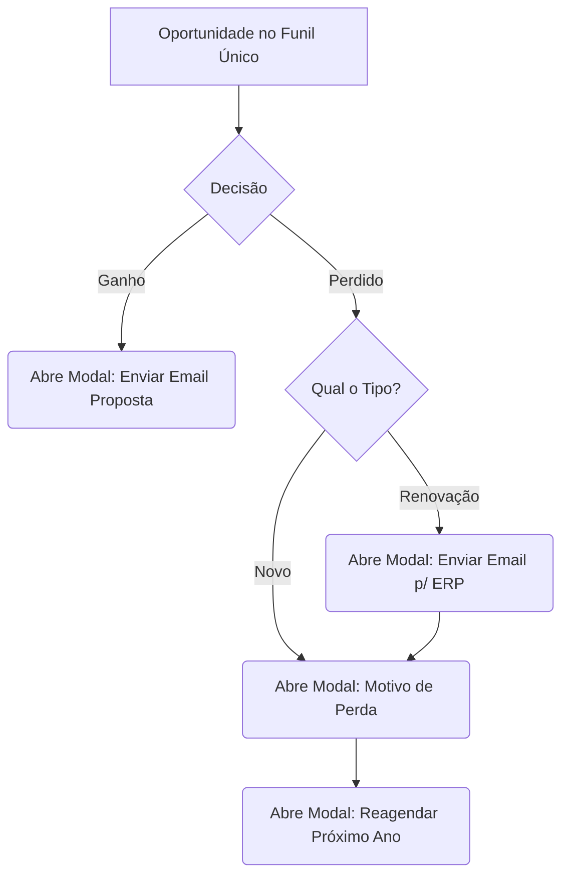
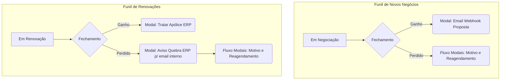

# Brainstorm: Ganhos, Perdas e Funis Estratégicos

Com base no seu relato, estamos lidando com processos que se misturam no mesmo lugar. Quando misturamos "Novos" com "Renovações", e "Vendas" com "Pós-Venda" em um único funil, a interface fica poluída de regras complexas que não se aplicam a todos os cenários. 

Aqui estão algumas provocações e alternativas desenhadas em fluxos para nos ajudar a pensar na melhor arquitetura para o CRM.

---

## O Problema Atual (Funil Único)

Atualmente, tenta-se gerenciar tudo em um só lugar. Isso gera o problema que você mencionou: **regras condicionais pesadas na interface**, como "abrir modal de email se for renovação E perdido".



> [!WARNING]
> **Desvantagem desse modelo:** Quanto mais o negócio crescer, mais condicionais no código serão necessárias para tratar exceções no modal principal. Cada novo tipo de seguro ou regra de negócio exigirá uma condicional (`if/else`) na tela.

---

## Alternativa 1: Separação de Funis por Natureza do Negócio (Novo x Renovação)

A primeira provocação é **separar a "aquisição" da "manutenção"**. 
Se os passos para tratar um negócio "Novo" são diferentes de uma "Renovação" (inclusive no caso de perda, que exige aviso ao ERP num email interno), eles devem pertencer a funis e fluxos distintos. O "TIPO" (*Novo / Renovação*) deixaria de ser apenas um campo select e seria representado visualmente pelo funil onde a oportunidade vive.



> [!TIP]
> **Vantagem:** A interface do modal "sabe" em qual funil a oportunidade está. Se estiver no funil de Renovação, o sistema automaticamente aciona o fluxo de fechamento para renovação. A regra logicamente sai do tipo de seguro e vai para o **contexto daquele funil**.

---

## Alternativa 2: Transição de Status Automáticas (A Jornada do Cliente)

Indo direto no seu ponto sobre "separar Vendas de Pós-Venda". Nós podemos tratar o CRM como uma esteira (*assembly line*).
O Modal `div#dealModal` (modal de vendas) foca em seguradora, comissão e prêmio. Um fluxo de Pós-Venda foca em emissão de boleto ou apólice. O que ganhamos em vendas logo se torna pós-vendas.

```mermaid
flowchart LR
    subgraph 1. VENDAS (Novos/Leads)
    V1(Prospect) --> V2(Cotação)
    V2 --> V3{Fechou Negócio?}
    V3 -->|Ganho| V4[Gatilho p/ Pós-Venda]
    V3 -->|Perdido| V5[Nutrição Reagendamento]
    end

    V4 -.-> |Cria/Move Card| P1

    subgraph 2. PÓS-VENDA (Emissão da Apólice)
    P1(Emissão/Boletos Recebidos) --> P2(Apólice Emitida - ERP)
    P2 -.-> |Fica lá até faltar 1 mês| R1
    P1 -->|Erro/Perdido na Emissão| P4(Estorno/Erro no ERP)
    end

    subgraph 3. RENOVAÇÃO
    R1(Vencendo este Mês) --> R2(Negociando Renovação)
    R2 --> R3{Fechou Negócio?}
    R3 -->|Ganho Renovação| P1
    R3 -->|Perdido Renovação| R4(Gatilho Aviso Quebra ERP interno)
    end
```

> [!IMPORTANT]
> **Por que pensar nessa estrutura?**
> Um "Negócio Ganho" em Vendas não é o final do card, apenas de uma etapa. Ao marcar Ganho num funil de vendas, ele "Avançaria" para o **Funil de Pós-Venda (Emissão)**, e depois cairia num **Funil de Renovação** 11 meses depois. Cada Funil (tabela ou aba) invoca um modal menor que só tem o que o corretor precisa *naquela fase*.

---

## Alternativa 3: Modais em Fila (Mantendo o Funil Único)

Caso sigamos com seu componente `dealModal` atual e todos continuem no mesmo funil por enquanto, a forma ideal e menos confusa de programar um "Encadeamento de Modais" (que abrem 1, e depois outro, e outro) no Javascript Vanilla é criar uma **Fila de Modais (Modal Queue)**. 

Em vez de verificar várias lógicas condicionais presas ao botão, o "Dar como Perdido" dispara um fluxo:

```javascript
function tratarPerda(oportunidade) {
  let filaDeModais = [];
  
  if (oportunidade.tipo === 'Renovação') {
    filaDeModais.push('modal-email-erp-interno'); // 1) Aviso ERP
  }
  
  filaDeModais.push('modal-motivo-perda'); // 2) Motivo
  filaDeModais.push('modal-reagendamento'); // 3) Próximo ano
  
  executarFilaModais(filaDeModais); // Função que consome o array e abre um modal por vez.
}
```

> [!NOTE]
> Essa abordagem isola a complexidade e modulariza os modais, garantindo que caso um processo a mais cresça no futuro (Ex: "se for ramo Auto abrir X"), apenas a máquina de fila seja alimentada sem quebrar a UI inteira.

---

### Próximos Passos (Decisão)

O que você acha?

- Qual dessas ideias soa mais natural à forma como a corretora já opera hoje?
- A ideia de **Separar os Funis** (Novo x Renovação x Pós-Venda) no banco te pareceu correta ou muito extrema?
- Quer focar em **resolver o front-end primeiro no funil atual**, estruturando os modais em uma fila e depois pensamos na separação do Pós-Venda?
